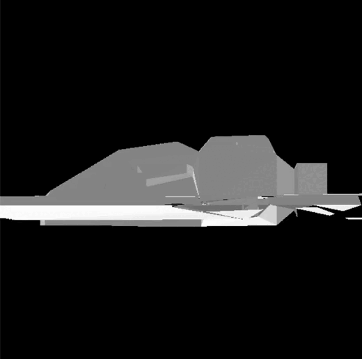

# SR 2: Flat Shading

Este código en C++ utiliza las bibliotecas SDL (Simple DirectMedia Layer) y OpenGL para renderizar un modelo 3D cargado desde un archivo OBJ. A continuación, se presenta un resumen del contenido:

## Contenido

1. **Bibliotecas y Constantes:**
   - Se incluyen las bibliotecas SDL, glm, iostream, vector, array, fstream, y sstream.
   - Se definen constantes como el ancho y alto de la ventana.

2. **Clase Color:**
   - Se define una clase `Color` para representar colores RGBA.

3. **Configuración de Uniformes y Z-Buffer:**
   - Se introduce una estructura `Uniform` para almacenar matrices de transformación.
   - Se crea un Z-buffer para gestionar la visibilidad de los píxeles en pantalla.

4. **Funciones de Transformación:**
   - `createModelMatrix`: Genera una matriz de modelo a partir de una posición y escala.
   - `createViewMatrix`: Calcula una matriz de vista para simular la cámara.
   - `createProjectionMatrix`: Crea una matriz de proyección para la perspectiva.
   - `createViewportMatrix`: Genera una matriz de transformación de viewport.

5. **Funciones de Dibujo:**
   - `point`, `line`, y `triangle` utilizan las funciones de SDL para dibujar puntos, líneas y triángulos.
   - `fillTriangle`: Rellena un triángulo aplicando sombreado plano y utiliza un Z-buffer para la visibilidad.

6. **Configuración de Iluminación:**
   - `calculateFlatShadingColor`: Calcula el color del sombreado plano utilizando intensidad de luz.

7. **Renderización y Transformación Continua:**
   - `render`: Renderiza un conjunto de vértices 3D aplicando las transformaciones proporcionadas por la estructura `Uniform`.
   - La función `main` inicia SDL, carga un modelo 3D, y entra en un bucle principal donde rota y renderiza continuamente el modelo.

8. **Funciones de Carga de Modelo:**
   - `setupVertex`: Escala y transforma los vértices del modelo 3D.
   - `loadOBJ`: Lee un archivo OBJ, realiza transformaciones y llena vectores con información del modelo.

9. **Bucle Principal:**
   - Maneja eventos de SDL y rota el modelo en cada iteración.
   - Renderiza el modelo continuamente hasta que se cierra la aplicación.

10. **Liberación de Recursos:**
    - Al salir del bucle principal, se liberan los recursos de SDL y OpenGL.

#MI MODELO

